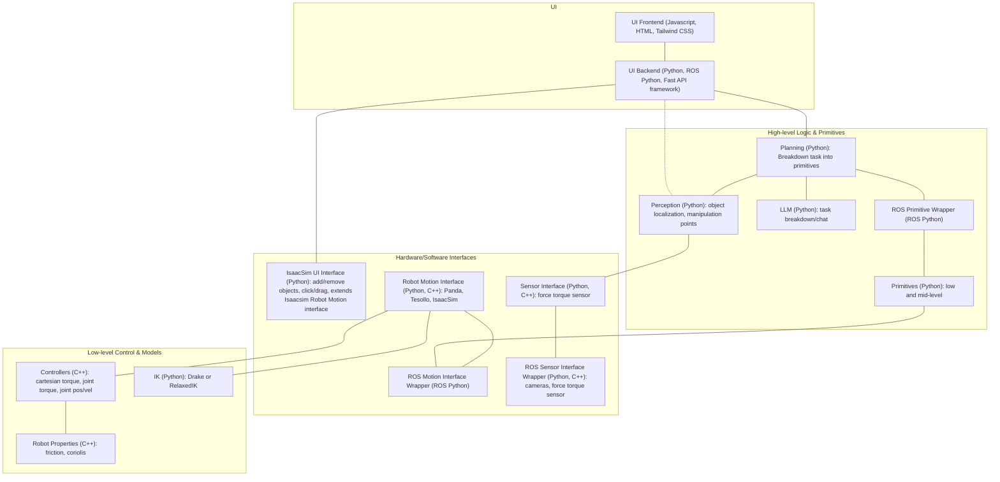

# Dexterity Interface


## Setup
### 0. Pull submodules
Make sure to pull the git submodules:
```bash
git submodule update --init --recursive
```
### 1. Setup Docker
On **BOTH computers**, follow the below steps.
Note: This allows you to run ros or isaacsim with docker. These instructions are an adapted version of [these](https://docs.isaacsim.omniverse.nvidia.com/5.0.0/installation/install_container.html) and [these](https://isaac-sim.github.io/IsaacLab/main/source/deployment/docker.html)

1. Install Docker by following the `Install using the apt repository` instruction [here](https://docs.docker.com/engine/install/ubuntu/#install-using-the-repository).

2. Install Nvidia Container Toolkit by following [these instructions](https://docs.nvidia.com/datacenter/cloud-native/container-toolkit/latest/install-guide.html). We recommend version 1.17.8 but other versions may work (although we know for sure that version 1.12 has Vulkan issues). 
    * Make sure you complete the `Installation` section for `With apt: Ubuntu, Debian` and also the `Configuring Docker` section.
    * To check proper installation, please run `sudo docker run --rm --runtime=nvidia --gpus all ubuntu nvidia-smi`. This should output a table with your Nvidia driver. If you run into `Failed to initialize NVML: Unknown Error`, reference [this post](https://stackoverflow.com/questions/72932940/failed-to-initialize-nvml-unknown-error-in-docker-after-few-hours) for the solution.

3. Install Docker compose by following there `Install using the repository` [instructions here](https://docs.docker.com/compose/install/linux/#install-using-the-repository).


### 2. Compile and Launch Docker Containers
Run each of these on the specified computer to build and launch the docker container. They will take a while the first time you run them. The reason there are 2 different containers to run is because the Isaacsim one takes A LOT longer to build and is A LOT larger so we also want to give the option of the smaller non-isaacsim container. 

a. On COMPUTER 1 (Docker with Isaacsim, ROS, and workplace dependencies):

```bash
xhost +local: # Note: This isn't very secure but is th easiest way to do this
sudo docker compose -f compose.isaac.yaml build
sudo docker compose -f compose.isaac.yaml run --rm isaac-base  # Opens TERMINAL 1
```

To test that isaacsim is working correctly, you can run `. /isaac-sim/isaac-sim.sh`.

NOTE: If you need to start another terminal, once the container is started, run `sudo docker compose -f compose.isaac.yaml exec isaac-base bash`

    
b. On COMPUTER 2 (Docker with just ROS and workspace dependencies):

```bash
xhost +local: # Note: This isn't very secure but is th easiest way to do this
sudo docker compose -f compose.ros.yaml build
sudo docker compose -f compose.ros.yaml run --rm ros-base  # Opens TERMINAL 2
```

NOTE: if you need to start another terminal, once the container is started, run `sudo docker compose -f compose.ros.yaml exec ros-base bash`. 


c. On COMPUTER 1 (Docker with nvidia ROS and workspace dependencies):

```bash
xhost +local: # Note: This isn't very secure but is th easiest way to do this
sudo docker compose -f compose.ros.gpu.yaml build
sudo docker compose -f compose.ros.gpu.yaml run --rm ros-gpu  # Opens TERMINAL 2
```

NOTE: if you need to start another terminal, once the container is started, run `sudo docker compose -f compose.ros.gpu.yaml exec ros-gpu bash`. 


### 3. Setup Packages
COMPUTER 1 requires 3 terminal open (TERMINAL 1 and 2 on the CONTAINER, TERMINAL 3 just on the computer). Open TERMINAL 2 in docker using `docker compose -f compose.isaac.yaml exec isaac-base bash`
COMPUTER 2 requires 1 terminal open.


1. On COMPUTER 1, TERMINAL 1, run:

    ```bash
    cd /workspace/libs/robot_motion_interface/ros
    colcon build --cmake-clean-cache --symlink-install

    cd /workspace/libs/primitives/ros
    colcon build --cmake-clean-cache --symlink-install
    cd /workspace
    ```

2. On COMPUTER 1, TERMINAL 3, run:

    ```bash
    npm install --prefix app/ui_frontend
    ```

3. On COMPUTER 2, TERMINAL 1, run:

    ```bash
    cd /workspace/libs/robot_motion_interface/ros
    colcon build --cmake-clean-cache --symlink-install

    cd /workspace/libs/primitives/ros
    colcon build --cmake-clean-cache --symlink-install
    cd /workspace
    ```

## Running 
1. In COMPUTER 1 TERMINAL 1, run:
    ```bash
    source libs/robot_motion_interface/ros/install/setup.bash
    source libs/primitives/ros/install/setup.bash

    # Launch simulation
    ros2 launch primitives_ros sim.launch.py
    ```

    Note: you can run isaacsim in full screen by default by running:
    ```bash
    ros2 launch primitives_ros sim.launch.py isaac_args:='--kit_args=--/app/window/hideUi=true'
    ```

2. In COMPUTER 1 TERMINAL 2, run:
    ```bash
    source libs/robot_motion_interface/ros/install/setup.bash
    source libs/primitives/ros/install/setup.bash
    uvicorn ui_backend.api:app --reload
    ```

    Note: you can run these other options (after sourcing), too:
    ```bash
    # Use default objects instead of machine vision/camera
    USE_VISION=false uvicorn ui_backend.api:app --reload  

    # Specify specific objects for task (1=set_table,2=pour_snack, 3=cleanup_table)
    TASK=3 uvicorn ui_backend.api:app --reload

    ```

3. WAIT until the terminal for STEP 1 says "Creating window for environment". Then in COMPUTER 1 TERMINAL 3, run:
    ```bash
    npm run dev --prefix app/ui_frontend/
    ```

    NOTE: If you instead want to build and run the frontend for production, run the following:
    ```bash
    npm run build --prefix app/ui_frontend/
    npx serve app/ui_frontend/dist
    ```

4. In COMPUTER 2, TERMINAL 1 run:
    ```bash
    source libs/robot_motion_interface/ros/install/setup.bash
    source libs/primitives/ros/install/setup.bash
    ros2 launch primitives_ros real.launch.py
    ```

5. On COMPUTER 1's web browser, go to http://127.0.0.1:3000.
    Note, there are also 2 other versions of the system:
    ```bash
    # Show no plan
    http://127.0.0.1:3000?show_plan=false

    # Allow no plan editing/interaction
    http://127.0.0.1:3000?plan_interaction=false
    ```

    Note: API docs are at  http://127.0.0.1:8000/docs and the API is at http://127.0.0.1:8000/api/<PATH_HERE>.


## Other Setup Options
* Here is another container for Docker with ROS and gamepad/xbox controller (and workspace dependencies). It is good for teleop in  the `primitives` package. The reason there are multiple different containers to run is because the Isaacsim one takes A LOT longer to build and is A LOT larger so we also want to give the option of the smaller non-isaacsim containers.
    ```bash
    xhost +local: # Note: This isn't very secure but is th easiest way to do this
    sudo docker compose -f compose.ros.yaml build
    sudo docker compose -f compose.ros.yaml -f compose.ros.gamepad.yaml run --rm ros-base
    ```

    NOTE: if you need to start another terminal, once the container is started, run `sudo docker compose -f compose.ros.yaml -f compose.ros.gamepad.yaml exec ros-base bash` 


* If you just want to install and run the examples in the child packages (in `libs`), you can do this much more easily with python:

    1. Create a python virtual environment:

        ```bash
        python3.11 -m venv venv-dex
        source venv-dex/bin/activate
        ```
    2. Install the dependencies of all the dependencies by following all the READMEs of the packages inside of the `libs/` folder. Install these in the following order: robot_motion, robot_motion_interface, robot_description, primitives, sensor_interface, planning.


## System Architecture


## Installing Curobo
TODO: MOVE

1. Check that your Cuda Driver Version is >=520:
    ```bash
    nvidia-smi
    ```

    If it is less than this, you will need to upgrade (google instructions).

2. Check that Cuda Toolkit is >=11.8:

    ```bash
    nvcc --version
    ```

    If you don't have the toolkit, run 
    ```bash
    sudo apt install nvidia-cuda-toolkit
    nvcc --version
    ```


    If it is less than 11.8, use the runfile instructions [here](https://developer.nvidia.com/cuda-11-8-0-download-archive?target_os=Linux&target_arch=x86_64&Distribution=Ubuntu&target_version=22.04&target_type=runfile_local) to install 11.8.

    * On CUDA Installer Screen, only check "CUDA Toolkit 11.8".

    After installation, run these commands to check the installation and set the correct path (will need to redo the exports if you ever open a new terminal):
    ```bash
    ls /usr/local | grep cuda   # Make sure output cuda-11.8

    export PATH=/usr/local/cuda-11.8/bin:$PATH
    export LD_LIBRARY_PATH=/usr/local/cuda-11.8/lib64:$LD_LIBRARY_PATH

    nvcc --version  # Make sure it says cuda_11.8.r11.8
    ```

3. Install dependencies:


    ```bash
    sudo apt install git-lfs
    ```

    Start a venv for these and then run these:
    ```bash
    pip install --upgrade pip setuptools wheel
    pip install torch
    pip install matplotlib  # For examples
    ```


## TODO:
- Split docker files into more to speed up compilation for dev


## Testing
```bash
curl -X POST "http://127.0.0.1:8000/api/primitive_plan" \
  -H "Content-Type: application/json" \
  -d '{
        "task_prompt": "Test",
        "revision_of": null
      }'
```


